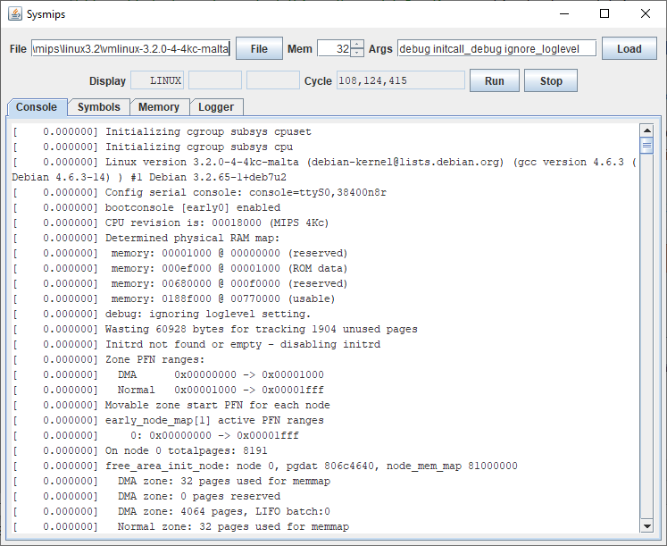

# Sysmips

A MIPS Technologies Malta system emulator, with a MIPS32 4Kc processor, Galileo GT-64120A northbridge and Intel PIIX4 southbridge

Intended to run an unmodified Linux kernel

Loosely based on the mipsem project (a user-level MIPS R2000A/Linux emulator)

This project is NOT officially associated with Imagination Technologies or any other company

## Suggested Reading

MIPS:

* [LinuxMIPS Wiki](http://www.linux-mips.org/wiki/MIPS_Malta)
* MIPS32 Architecture For Programmers Volume I: Introduction to the MIPS32 Architecture (c. 2001 for MIPS32 release 1)
* MIPS32 Architecture For Programmers Volume II: The MIPS32 Instruction Set (c. 2001)
* MIPS32 Architecture For Programmers Volume III: The MIPS32 Privileged Resource Architecture (c. 2001)
* MIPS32 4K Processor Core Family Software User's Manual (c. 2001-2002)
* MIPS Malta User's Manual (c. 2001-2002)
* MIPS YAMON User's Manual (c. 2004?)
* MIPS YAMON Reference Manual (c. 2001)
* MIPS YAMON source code

Hardware:

* Galileo GT-64120A System Controller Datasheet (2001)
* Intel 82371AB PCI-TO-ISA / IDE XCELERATOR (PIIX4) (1997)
* SMSC FDC37M81x PC98/99 Compliant Enhanced Super I/O Controller (2000)
* SMSC KBD43W13 Keyboard and PS/2 Mouse Controller (1998)
* [OSDev Wiki](http://wiki.osdev.org/) - Information on PS/2 controller, RTC, etc
* IBM PC Technical Reference (1984)
* Intel 8259A PROGRAMMABLE INTERRUPT CONTROLLER (1988)

Linux:

* [Linux 3.2.68 source code](https://cdn.kernel.org/pub/linux/kernel/v3.x/) - particularly arch/mips/include/asm and arch/mips/mti-malta
* [Linux Cross Reference](http://lxr.free-electrons.com/source/?v=3.2)
* Tool Interface Standard (TIS) Executable and Linking Format (ELF) Specification Version 1.2 (1995)
* System V Application Binary Interface MIPS RISC Processor Supplement 3rd Edition (1996)

## Suggested Software

[Linux kernel image](https://packages.debian.org/stable/kernel/) - search for linux-image-(version)-4kc-malta
 * extract using ar -x *.deb; tar -xf data.tar.xz
 * it's only been developed with "vmlinux-3.2.0-4-4kc-malta" which is no longer available for download

## Screenshot

## Download

No binary download provided
